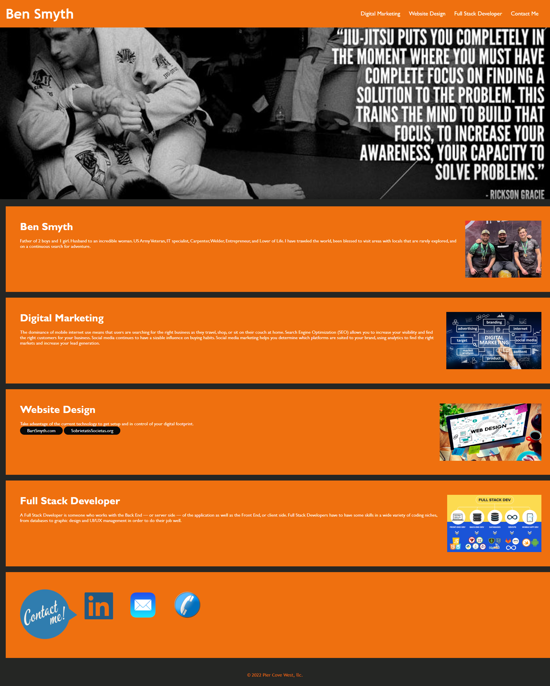

Create a portfolio showcasing the work and/or past work of student
-navigation
-About Me
-Website Design (Past Work)
-Full Stack Developer (Current Program)
-Applications (Placeholder with images to future projects)
-Contact Me (How to contact Ben Smyth)

Ben Smyth: An active student in Michigan State University's Full Stack Developer Bootcamp graduating in May 2023

Provided Links to past work
Provided Links to contact him

https://bsmyth310.github.io/Ben-Smyth-Portfolio/

